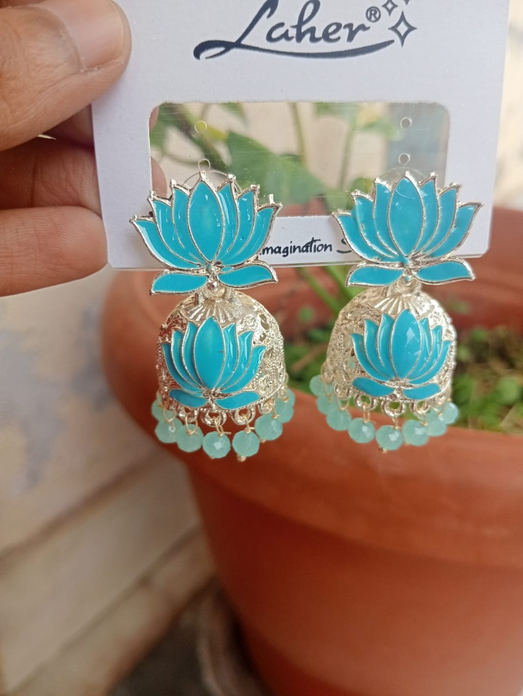
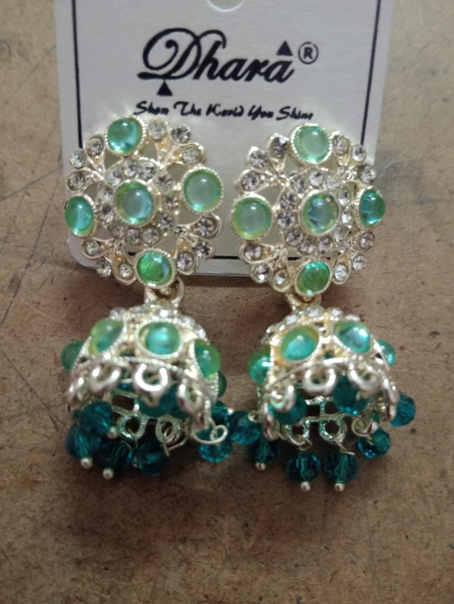
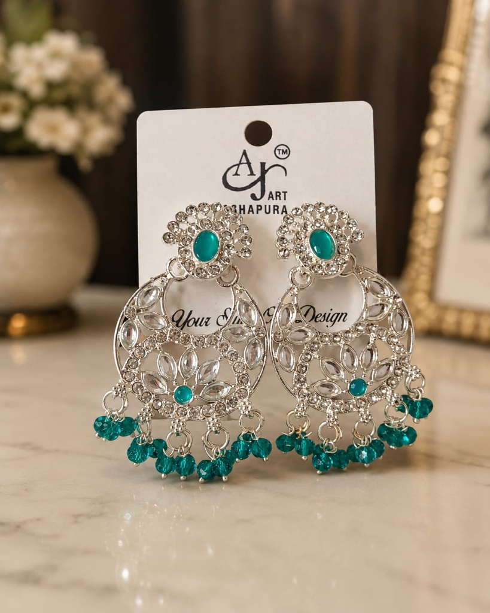
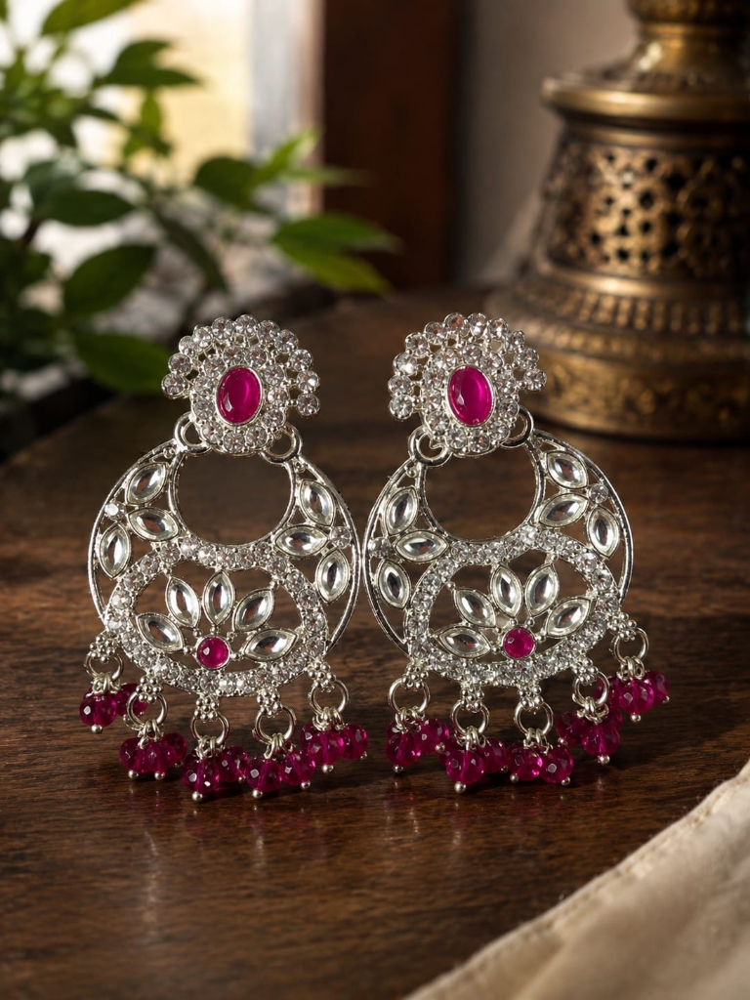

# 👑 SR Jewellery Collections

<p align="center">
  
  
  
  
  
  
</p>

---

## 💎 Project Overview

**SR Jewellery Collections** is an end-to-end, high-converting luxury Indian heritage e-commerce web platform and SaaS-style Admin Operations Portal. 

Crafted with **3D perspective depth aesthetics**, **Kundan, Polki & Gold theme**, and high-converting UX, it allows customers to browse, review, and purchase authentic Indian jewellery items, while providing store administrators with real-time inventory management, order processing, custom coupon creation, and printable tax invoices.

> 🚀 **Built & Designed by**: [Vision Verse24 (@vision_verse24)](https://instagram.com/vision_verse24) — *Ideas. Code. Impact.*

---

## 📸 Showcase & Real Jewellery Collection

<div align="center">
  <table>
    <tr>
      <td align="center">
        <br />
        <b>Laher Cyan Blue Lotus Jhumka</b>
      </td>
      <td align="center">
        <br />
        <b>Dhara Emerald Green Jhumka</b>
      </td>
      <td align="center">
        <br />
        <b>AJ Art Silver Emerald Chandbali</b>
      </td>
      <td align="center">
        <br />
        <b>Royal Silver Ruby Chandbali</b>
      </td>
    </tr>
  </table>
</div>

---

## ✨ Key Features & Capabilities

### 🛍️ 1. Customer Storefront
- 🏆 **3D Depth & Perspective Aesthetics**: Interactive 3D tilt cards (`card-3d`), metallic gold gradients, and glassmorphic overlays.
- 💎 **Curated Catalogue**: Handcrafted Kundan, Polki, Gold & Diamond collections with search, category filtering, and price sorting.
- 📱 **100% Responsive Design**: Pixel-perfect layout across Mobile Phones, Tablets, iPads, Laptops, and 4K Displays.
- 🔐 **Mandatory User Login Guard**: Unauthenticated checkouts are blocked safely, keeping user address books isolated by `currentUser.id`.
- 🔄 **Session Retention**: Browser refresh (`F5`) retains active customer sessions (`srj_active_user`), shopping cart, and wishlist state.
- 💳 **0% Commission Direct UPI Gateway**: Dynamic QR Code modal generated with the exact payable amount. Customers scan via Google Pay, PhonePe, Paytm, or BHIM, and submit their 12-digit UTR reference.
- 📜 **Customer Reviews & Ratings System**: 5-Star rating selector on product pages and purchase order history.

### 🛡️ 2. Admin Operations Portal (`/admin/login`)
- 🔒 **Dedicated Security Login**: Standalone `/admin/login` page with role middleware protection.
- 📊 **Real-time Analytics Dashboard**: Live sales volume, order counts, COD vs UPI payment share, and low-stock alerts.
- 📦 **Products & Stock Management**: Full CRUD interface for adding products, adjusting stock levels, and viewing inventory history.
- 📑 **Order Processing & Printable Invoices**: Order status lifecycle (`CONFIRMED` → `PACKED` → `SHIPPED` → `DELIVERED`), courier tracking updates, and 1-click printable tax invoices (`/admin/orders/[id]/invoice`).
- 🎟️ **Custom Coupon Creator**: Promo code manager supporting Percentage (%) and Flat (₹) discounts, min order limits, and max caps.
- 💬 **Customer Contact Desk**: Inbound message management with 1-click Call, Email, and WhatsApp action buttons.
- 🏢 **Dynamic Store Profile Sync**: Changing Store Name, Phone, Address, WhatsApp, or Social links updates the storefront in real-time.

---

## 🛠️ Tech Stack & Architecture

| Technology | Purpose |
| :--- | :--- |
| **Framework** | Next.js 14 (App Router) + TypeScript |
| **Styling** | Vanilla CSS + Tailwind CSS + 3D Glassmorphic Tokens |
| **Icons & UI** | Lucide React |
| **Charts** | Recharts (Sales & Revenue Trends) |
| **State & Persistence** | React Context (`StoreContext`, `CartContext`) + `localStorage` Hydrator |
| **Backend / DB Option** | Supabase (PostgreSQL schema included in `supabase/schema.sql`) |

---

## 🚀 Quick Start Guide

### 1. Clone & Install Dependencies
```bash
git clone https://github.com/YOUR_USERNAME/SR-Jewellery-Collections.git
cd SR-Jewellery-Collections
npm install
```

### 2. Run Local Development Server
```bash
npm run dev
```
Open **`http://localhost:3000`** in your browser.

### 3. Admin Access Setup
Navigate to **`http://localhost:3000/admin/login`**
- Create an Admin user in your Supabase Auth console and assign `role = 'ADMIN'` in the `public.profiles` table.

---

## 🌐 Deploy to Vercel (100% Free)

This project is optimized for 1-click deployment on **[Vercel](https://vercel.com)**:

```bash
npx vercel
```
Follow the 30-second CLI prompts to receive your live production URL (*e.g., `https://sr-jewellery.vercel.app`*)!

---

## 🎨 Developed By: Vision Verse24

<p align="center">
  <a href="https://instagram.com/vision_verse24" target="_blank">
    
  </a>
</p>

> **Need a website like this for your business, college project, or startup?**  
> We build modern, high-converting e-commerce stores, web applications, and custom software.
> 
> 📲 **Connect with us on Instagram**: [@vision_verse24](https://instagram.com/vision_verse24)  
> ⚡ **Services Offered**: Business Websites (from ₹1,500), College Projects (from ₹499), Custom Web Applications & Free Deployment Support!

---

## 🛡️ Security Audit & Hardening Status

- ✅ **OWASP Top 10 Hardened**: Role authorization, anti-tampering, IDOR prevention, and XSS sanitization enforced.
- 🔐 **Middleware Protection**: Unauthenticated requests to `/admin/*` are blocked and redirected safely.
- 🛡️ **Sanitized Inputs**: Customer forms and UTR transaction numbers are sanitized against script injections.
- 📄 **Security Documentation**:
  - `SECURITY_AUDIT.md` — Complete vulnerability findings and fixes summary.
  - `SECURITY_TEST_MATRIX.md` — Pass/Fail test execution matrix.
  - `INCIDENT_RESPONSE.md` — Security incident handling standard operating procedures.

---

## 📄 License
© 2026 **SR Jewellery Collections**. All rights reserved. Handcrafted with precision in India.
